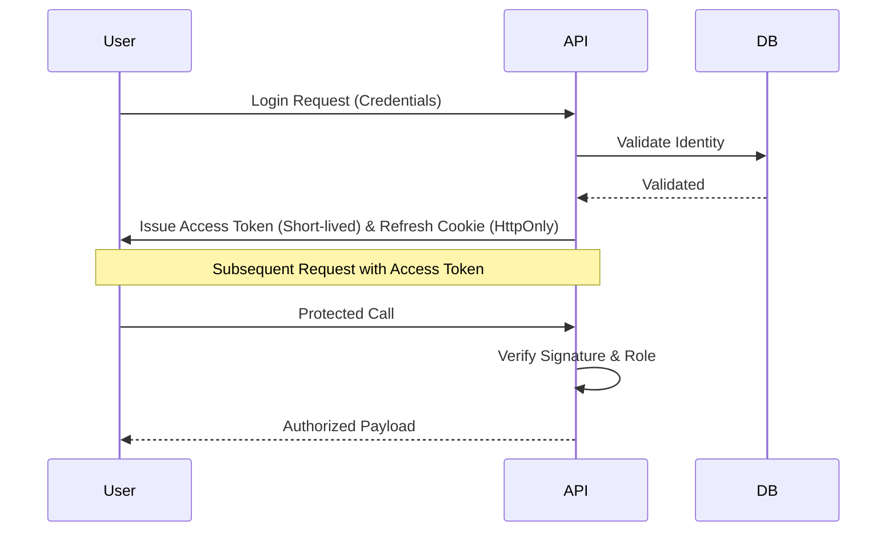

# CV TECH | Digital Monolith Platform

[](https://mongodb.com)
[](https://aws.amazon.com/s3)
[](https://socket.io)

> **Enterprise-grade SaaS infrastructure for modern project marketplaces and digital asset management.**

---

## 🏗️ 1. Project Overview

**CV TECH** is a high-performance, full-stack SaaS platform designed to facilitate the secure exchange, management, and deployment of digital assets. Built with a **Digital Monolith** philosophy, it integrates a sophisticated marketplace, real-time communication channels, and a robust administrative core.

### 🌐 Ecosystem Logic
*   **The Marketplace**: A premium, high-contrast interface for browsing and acquiring precision-engineered projects.
*   **The Nexus (Admin)**: A powerful dashboard for managing users, projects, orders, and real-time support threads.
*   **The Client Vault**: A dedicated user workspace for tracking purchases, wishlists, and project downloads.

---

## ⚡ 2. Core Features

| Feature | Description | Implementation |
| :--- | :--- | :--- |
| **Identity Nexus** | Multi-tier Authentication (SuperAdmin, Admin, User) | JWT + Refresh Tokens |
| **Asset Distribution** | Secure S3-backed image and file delivery | AWS SDK v3 + Pre-signed URLs |
| **Notification Engine** | Role-based real-time alerts & read receipts | Socket.IO + Multi-user `readBy` Logic |
| **Marketplace Core** | Cart, Wishlist, and Transactional integrity | MongoDB + Razorpay |
| **Admin Project Vault** | Full CRUD with secure ZIP & Gallery management | Glassmorphic Editor Modals |
| **Security Layer** | reCAPTCHA v3 & Role-based Socket Partitioning | Middleware-first security |

---

## 🛠️ 3. Full Tech Stack

### Frontend
- **React 19** (Vite-powered SPA)
- **Tailwind CSS v4** (Utility-first styling)
- **Framer Motion** (Production-grade animations)
- **Axios** (Defensive API consumption)
- **Zustand** (Atomic state management)

### Backend
- **Node.js & Express.js** (Async middleware architecture)
- **MongoDB & Mongoose** (Schema-driven data modeling)
- **Socket.IO** (Bidirectional event-driven communication)
- **AWS SDK v3** (Cloud asset orchestration)
- **Nodemailer** (Automated communication services)
- **Bcrypt & JWT** (Cryptographic identity protection)

---

## 📂 4. Folder Structure

### Backend Architecture
```text
backend/
├── config/             # Environment & Cloud configurations
├── controllers/        # Business logic & Response mapping
├── logs/               # Production logs (Winston/Morgan)
├── middleware/         # Security, Auth, and Validation layers
├── models/             # Mongoose schemas & Database constraints
├── public/             # Static asset distribution
├── routes/             # API endpoint definitions
├── services/           # External integrations (Mail, S3)
├── socket/             # Socket.IO event handlers & room partitioning
└── utils/              # Cryptographic & Helper utilities
```

### Frontend Architecture
```text
frontend/
├── src/
│   ├── assets/         # Optimized imagery & Global icons
│   ├── components/     # Atomic UI components
│   ├── hooks/          # Reactive custom hooks
│   ├── lib/            # Axios & Library initializers
│   ├── pages/          # Full-page view components
│   ├── services/       # API abstraction layer
│   └── store/          # Zustand state definitions
```

---

## 🛡️ 5. Security & Auth Flow

### JWT Lifecycle
CV TECH implements a dual-token strategy for maximum security without compromising user experience.



### Security Measures
- **Password Hashing**: Bcrypt with adaptive salt rounds.
- **CSRF Protection**: HttpOnly cookies for sensitive token storage.
- **Rate Limiting**: Preventing brute-force attacks on critical auth routes.
- **S3 Security**: Dynamic generation of 1-hour pre-signed URLs; no public bucket access.

---

## 📂 6. Production Hardening & Bug Resolutions

Below is the technical ledger of critical resolutions implemented during the development phase.

### **A. Real-Time Message Alignment**
- **Error**: Messages sporadically flipped sides after a page reload or socket sync.
- **Root Cause**: Type mismatch during `senderId` comparison (Object vs String).
- **Solution**: Implemented strict string normalization in the message rendering logic.
```javascript
// src/pages/UserMessages.jsx
const isSentByMe = String(msg.senderId) === String(user._id);
```

### **B. Global reCAPTCHA UI Conflicts**
- **Error**: The reCAPTCHA v3 badge obstructed footer interactions and layout symmetry.
- **Solution**: Site-wide CSS override to hide the badge while keeping the protection logic active.
```css
/* src/index.css */
.grecaptcha-badge { 
    visibility: hidden !important; 
}
```

### **C. Light Mode Visual Depth**
- **Error**: Floating hero widgets and glass-cards lost definition in high-brightness themes.
- **Solution**: Switched from static white transparencies to dynamic theme tokens.
```javascript
// Replacement of bg-white/20 with:
className="bg-on-surface/10 border-outline-variant/30"
```

### **D. Notification Sync Fault (Backend Import)**
- **Error**: "Registry synchronization failure" alert in the notification dropdown.
- **Root Cause**: Module resolution failure due to incorrect middleware import (`authMiddleware` vs `auth`).
- **Solution**: Standardized internal routing imports and implemented defensive error states in the frontend store.

### **E. Shared Notification Read Conflict**
- **Error**: Marking a broadcast notification (e.g., "New Project") as read for one admin marked it for everyone.
- **Solution**: Refactored the `Notification` schema to replace boolean `isRead` with a `readBy` array of user IDs. 

### **F. Socket Room Security Leak**
- **Error**: Administrative events were occasionally broadcasting to standard user rooms.
- **Solution**: Implemented strict role-based room partitioning during the socket `join` sequence.

---

## 🚀 7. Predictive Scalability & Future Challenges

Architectural strategy for the next phase of CV TECH growth.

### **Challenge 1: Real-Time Event Saturation**
- **Context**: As the user base expands, the Node.js event loop may struggle with thousands of concurrent socket connections.
- **Solution**: Implement a **Redis Pub/Sub adapter** for Socket.IO to horizontally scale the backend.
```javascript
// Future implementation
const { createAdapter } = require("@socket.io/redis-adapter");
io.adapter(createAdapter(pubClient, subClient));
```

### **Challenge 2: Heavy Asset Delivery**
- **Context**: High-resolution project thumbnails may cause Cumulative Layout Shift (CLS).
- **Solution**: Implement **BlurHash** placeholders and a **CloudFront CDN** layer.
```javascript
// Future UI enhancement
<Blurhash hash={project.blurhash} width={400} height={300} />
```

### **Challenge 3: Database Write Pressure**
- **Context**: Real-time message persistence in MongoDB can become a bottleneck.
- **Solution**: Transition to a **Write-Behind Cache** strategy using Redis.

---

## 💻 8. Local Development Setup

### Prerequisites
- Node.js (LTS)
- MongoDB Atlas Account
- AWS IAM User (S3 Full Access)

### Installation
1.  **Clone the Repository**
2.  **Backend Configuration**
    ```bash
    cd backend
    npm install
    # Create .env with the variables listed below
    npm run dev
    ```
3.  **Frontend Configuration**
    ```bash
    cd frontend
    npm install
    npm run dev
    ```

### Required Environment Variables (.env)
```env
# Server
PORT=5000
NODE_ENV=development
MONGO_URI=your_mongodb_uri
JWT_SECRET=your_jwt_secret

# AWS
AWS_ACCESS_KEY=your_key
AWS_SECRET_KEY=your_secret
AWS_REGION=your_region
S3_BUCKET=your_bucket_name

# Email
SMTP_HOST=smtp.gmail.com
SMTP_USER=your_email
SMTP_PASS=your_app_password
CONTACT_RECEIVER_EMAIL=admin@cvtech.io
```

---

## 🗺️ 9. Future Roadmap
- [x] **Unique Hero Assets**: Per-page architectural imagery.
- [x] **Newsletter Integration**: Fully validated footer subscription.
- [x] **Notification Ecosystem**: Real-time alerts with multi-user read receipts.
- [x] **Admin Project Vault**: Fully functional project CRUD and media management.
- [ ] **AI-Powered Analytics**: Predictive revenue modeling.
- [ ] **Stripe/Paypal Integration**: Global multi-currency support.

---

## 📝 10. Licensing & Compliance

© 2026 CV TECH. All Rights Reserved. **Developer Never Dies.**
This platform is built for performance, security, and scalability. Distributed as proprietary SaaS infrastructure.
